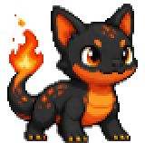
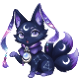
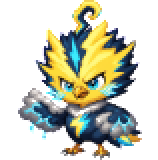
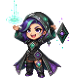
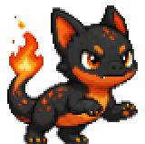
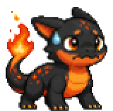
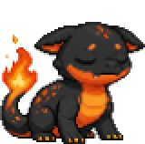
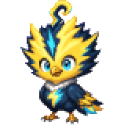

<div align="center">







# Vibepaws

**A cute coding pet that watches your AI agents, pings you when they need you, and grows from healthy vibe-coding sessions.**

Local-first · always-on-top · never reads your code

[Quick start](#quick-start-3-minutes) · [Connect your agent](#connect-your-coding-agent) · [How growth works](#how-your-pet-grows) · [Privacy](#privacy-what-leaves-your-machine) · [中文文档](README.zh-CN.md)

</div>

---

## The problem

You start Claude Code, it runs for four minutes, and then it stops — waiting for you to approve one file write. You're in another window. You find out six minutes later.

Or: the session has been going great, you're deep in it, and you don't notice that context is at 94% until the agent starts forgetting the constraint you set twenty messages ago.

Coding agents are good at working. They're bad at getting your attention, and terrible at telling you when they've stopped being useful.

## What Vibepaws does

A small pet sits on your desktop, above your fullscreen terminal. It reads events from your coding agents and turns them into something you can catch out of the corner of your eye:

- **The agent needs you** → the pet looks up at you and a bubble appears, within seconds
- **Context is filling up** → warning at 70%, 85%, 95%, each fired once, not nagged
- **Token budget milestones** → 25% / 50% / 75% / 90% of the budget you set
- **The agent errored or stalled** → you find out now, not on your next window switch
- **The session finished** → the pet earns EXP, levels up, and eventually evolves

The pet also grows — but the growth loop is deliberately built so that **burning tokens does not level up your pet**. Sloppy sessions (context at 96%, correction loops) earn a fraction of the EXP that clean ones do. Healthy usage is the only fast path. See [How your pet grows](#how-your-pet-grows).

And it never sees your code. Prompts, diffs, file paths, and tool inputs are dropped at the adapter and dropped again at the database. See [Privacy](#privacy-what-leaves-your-machine).

## Status

**MVP alpha 0.1** — the core loop works end to end on Claude Code, Codex, and pi-coding-agent. Honest state of things:

| | |
| --- | --- |
| ✅ **Works today** | Desktop pet with 7 states · decision & permission bubbles · context warnings · EXP / levels · mute (30m / 2h / project / session) · settings window (budget, warning thresholds, session goals, pet name, language) · Claude Code + Codex + pi adapters · generic JSONL bridge · event simulator · privacy allowlist |
| ⚠️ **Partial** | 5 of 12 planned starter pets · topic-drift heuristics wired but thin · evolution rules fire but evolved-form art isn't drawn yet |
| ❌ **Not yet** | Voice commands (STT) · graphical onboarding wizard · anything social (gallery, leaderboard, trading) |

Full requirement-by-requirement status: [PRD §15](docs/prd_mvp_en.md#15-implementation-status-as-of-2026-08-21).

---

## Quick start (3 minutes)

### Requirements

**Node ≥ 22.6.** This is a hard floor, not a suggestion. Core, the UI server, and the collector command written into your agent's hook config all run under `node --experimental-strip-types`, and that flag doesn't exist before 22.6. On Node 20 nothing starts — and the hook path fails *silently*, so the pet just sits there idle instead of telling you anything is wrong.

```bash
node --version   # must be v22.6.0 or higher
npm install
```

macOS is the tested platform today. Windows and Linux aren't blocked by design, but haven't been exercised.

### 1. Start Core

Core is the daemon: it ingests events, tracks sessions, runs the notification and EXP engines, and owns the SQLite database.

```bash
npm run core     # listens on 127.0.0.1:17893
```

First run initializes `.vibepaws/vibepaws.db`, rolls you a **random starter pet**, and writes an API token to `.vibepaws/api_token`. Core binds localhost only, and every route except `/health` requires that token.

### 2. Start the pet

In a second terminal:

```bash
npm run desktop  # transparent always-on-top window, bottom-right, with a tray icon
```

> In dev mode Core and the pet are separate processes — start Core first. A packaged `.app` launches Core for you.

### 3. Watch it work, without an agent

The simulator emits real events into Core, so you can see every behavior before wiring up anything:

```bash
npm run sim -- --scenario normal              # normal session → working → finished
npm run sim -- --scenario frequent_decisions  # repeated "needs you" → bubbles
npm run sim -- --scenario context_overload    # context 88% → 96% → warnings + EXP penalty
npm run sim -- --scenario correction_loop     # same file edited over and over → correction count
npm run sim -- --scenario multi_session       # 3 parallel sessions → aggregated state + carousel
```

If the pet reacts to `normal`, your install is good. Now connect a real agent.

---

## Connect your coding agent

One command per agent. The installer backs up your existing config, writes the hook entries, and fires a self-test event so you know immediately whether the channel is live.

```bash
# Claude Code — hooks + statusLine (the live token channel)
npm run adapter:install -- --agent claude_code            # this repo only  → <repo>/.claude/settings.json
npm run adapter:install -- --agent claude_code --global   # all projects    → ~/.claude/settings.json

# Codex
npm run adapter:install -- --agent codex                  # this repo only  → <repo>/.codex/hooks.json
npm run adapter:install -- --agent codex --global         # all projects    → ~/.codex/hooks.json

# pi-coding-agent — installed as a pi extension, not a hook config
npm run adapter:install -- --agent pi                     # this repo only  → <repo>/.pi/extensions/vibepaws.ts
npm run adapter:install -- --agent pi --global            # all projects    → ~/.pi/agent/extensions/vibepaws.ts
```

**Global or project — pick one.** Switching to `--global` automatically removes Vibepaws' project-level hooks from this repo, because running both means duplicate events: double EXP, double bubbles.

**Per-agent notes:**

- **Claude Code** — `statusLine` is where live token counts come from. It's a Claude-only capability, and it's what makes the token channel real-time instead of end-of-session.
- **Codex** — run `/hooks` inside Codex once to authorize hooks. Tokens are extracted from the SessionEnd transcript, so they arrive at the end of a session rather than continuously.
- **pi-coding-agent** — pi has no config-style hooks, so the stable integration is a **pi extension**. The installer copies `src/adapters/pi_extension.ts` into pi's plugin directory, where it binds to pi lifecycle events and reports state deterministically — same tier as Claude/Codex hooks, not something the model has to remember to do. Any exception inside the plugin is swallowed so it can never interrupt pi. **Open a new `pi` session (or `/reload`) for it to take effect.** A project-level plugin also requires the project to be trusted by pi (confirm at first launch).

  For other harnesses, or an environment where plugins aren't available, there's a manual emitter:

  ```bash
  node --experimental-strip-types src/adapters/pi_agent.ts --event=decision_required
  ```

<details>
<summary><strong>What each agent event maps to</strong></summary>

| Vibepaws event | Claude Code | Codex | pi |
| --- | --- | --- | --- |
| `session_started` | `SessionStart` | `SessionStart` | `session_start` (startup/resume/fork/reload) |
| `agent_working` | `UserPromptSubmit`, `PreToolUse` | `UserPromptSubmit`, `PreToolUse` | `before_agent_start`, `tool_execution_start` |
| `decision_required` | `Stop`, `Notification` | `Stop` | `agent_settled` (agent is idle, waiting on you) |
| `permission_required` | `PermissionRequest` | `PermissionRequest` | tool approval path |
| `token_update` | **statusLine (live)**, `PostToolUse` | `SessionEnd` transcript extraction | `message_end` usage (**real tokens/cost**) |
| `context_update` | statusLine `used_percentage`, `PreCompact`/`PostCompact` | `PreCompact`/`PostCompact` | `session_compact` |
| `session_error` | `PostToolUseFailure`, `PostToolUse` (error) | `PostToolUse` (error) | `tool_execution_end` (isError) |
| `session_finished` | `SessionEnd` | `SessionEnd` | `session_shutdown` |

`Stop` is the important one on Claude Code: it's the only immediate "your turn" signal. `SessionEnd` only fires when the session actually exits, and `Notification` is either a permission popup or a 60-second idle timeout.

`SubagentStart` / `SubagentStop` are also collected on both hook-based agents.

Missing events degrade, they don't break: if an agent version stops emitting something, Vibepaws skips that signal or approximates it, and the core loop keeps running.

</details>

### If Core isn't running

Adapters never block your agent and never lose events. When Core is unreachable they append to local JSONL:

- Claude/Codex hooks → `.vibepaws/events/fallback.jsonl` (repo root)
- pi extension → `~/.vibepaws/events/pi_*.jsonl` (user-level — the plugin is self-contained and doesn't know your repo path)

Then backfill:

```bash
npm run bridge   # watches both directories, normalizes, forwards to Core
```

The same bridge is the **generic integration path** for any tool that isn't Claude/Codex/pi: write normalized JSON lines into `.vibepaws/events/`, and they become pet state. The envelope:

```json
{
  "event": "decision_required",
  "agent": "my_tool",
  "session_id": "local-session-id",
  "project_id": "/Users/me/my-app",
  "severity": "high",
  "safe_summary": "Tool permission needed",
  "timestamp": "2026-08-21T10:00:00Z"
}
```

Valid `event` values: `session_started` · `agent_working` · `decision_required` · `permission_required` · `token_update` · `context_update` · `topic_drift_warning` · `session_finished` · `session_error`

---

## Using the pet

### Seven states, seven drawings

Each state is a separate hand-checked portrait of the same pet, generated image-to-image. This is on purpose: posture and expression carry information that a jiggle animation and a corner badge can't. `tired` is heavy eyelids and a slumped body. `needs-you` is looking up, right at you.

<table>
<tr>
<td align="center"><br><code>idle</code></td>
<td align="center"><br><code>working</code></td>
<td align="center"><br><code>needs-you</code></td>
<td align="center"><br><code>warning</code></td>
<td align="center"><br><code>finished</code></td>
<td align="center"><br><code>tired</code></td>
<td align="center"><br><code>level-up</code></td>
</tr>
</table>

With several sessions running, the pet shows the **most urgent** state across all of them; the flyout breaks them down individually.

### Click the pet

The window expands *upward* — the pet itself doesn't move — and you get:

- **Session list** — click a row to copy that session's jump-back command. `needs-you` rows show how long the agent has been waiting on you.
- **Mute everything** — with a duration
- **EXP breakdown** — where the numbers came from
- **⚙ Settings** — opens the settings window (below)

Close it by clicking the pet again, clicking empty space, pressing `Esc`, or hitting the × in the corner.

### Settings

Tray menu → **Settings…**, or the ⚙ button in the flyout. It's a normal window, not a flyout page — the pet window is 300px wide and click-through, which is no place for a form.

| Section | What's in it |
| --- | --- |
| **Pet** | Name it. Empty falls back to the species name. |
| **Budget & warnings** | Default token budget (in k tokens; `0` turns milestones off) · context warning thresholds (off / early / default / late) · daily EXP cap |
| **Running sessions** | Per-session **goal** and **budget** for every agent session that's currently live |
| **Window** | Show on all Spaces · click-through · language · snap the pet back to the bottom-right |

Two things there are worth calling out:

**A session goal is not decoration.** It's the baseline for drift detection and it pays 1.1× EXP (see [How your pet grows](#how-your-pet-grows)). Sessions are born in your terminal, so the settings window is the only place to attach one — set it when you start something you care about.

**Changes take effect immediately, including mid-session.** Set a budget on a session that's already burned 60% and you get the 50% milestone on its next token update, not silence until tomorrow. Everything saves as you leave each field; out-of-range values are clamped and the field shows you what was actually stored.

The Core half of this window (budget, thresholds, goals, pet name) also works from the browser preview at http://127.0.0.1:5173/settings.html. The Window section needs the desktop shell and says so when it can't reach it.

### Mute is a visible state, not a silent switch

While muted, a 🔕 badge sits at the pet's feet showing the remaining time. Click the badge (or the button again) to bring notifications back. A mute you can't see is a mute you forget you set.

### The connection light

| Light | Meaning |
| --- | --- |
| 🟢 Green | Event stream healthy |
| 🟠 Amber (blinking) | State polling still works, but the event stream is dead — **bubbles won't arrive** |
| 🔴 Red | Can't reach Core at all |

Amber is the important one: without it, a broken hook looks exactly like a quiet afternoon.

### Window behavior

- **Drag** — grab empty space in the pet window. Position is remembered, and always clamped to the visible screen area.
- **Clicks pass through** the empty area around the pet's body, straight to the app underneath. The flyout needs room above the pet, and that room is normally empty space.
- **Tray menu** — click-through toggle · show on all desktops · show · settings · snap back to bottom-right · quit
- **Above fullscreen apps** — the pet stays visible over fullscreen iTerm2, fullscreen editors, and so on. This is not affected by the tray toggles. To make it possible the shell keeps no Dock icon, so **quit lives in the tray menu** — a macOS requirement: a process with a Dock icon cannot float over someone else's fullscreen Space.
- **Browser preview** (optional) — `npm run ui`, then open http://127.0.0.1:5173. If 5173 is busy the desktop shell picks a free port automatically (it's Vite's default port, so a stray dev server is likely).

> The shell is Electron today because this environment has no Rust toolchain. Tauri v2 replaces it once Rust is ready — shell layer only; rendering and the SSE protocol don't change.

### Language

The UI follows your OS language: any Chinese variant → Simplified Chinese, everything else → English. Tray menu, pet UI, bubbles, settings window, and the adapter installer all share one message catalog (`src/i18n/messages.js`), so you never get a half-translated screen.

To pick one explicitly, use **Settings → Language** — the tray menu, pet window, and settings window all switch on the spot, no restart. The environment variable still wins over that choice, for scripted runs:

```bash
VIBEPAWS_LOCALE=en npm run desktop      # or zh-CN
```

---

## How your pet grows

The design constraint that shapes everything else: **tokens feed the pet, but wasting tokens must not level it up.**

```text
session_exp = capped_token_exp
            × context_health_multiplier
            × topic_consistency_multiplier
            + outcome_bonus
            + daily_care_bonus
```

**Base rate** — 1 EXP per 1,000 tokens, with a **daily cap of 200 EXP** per pet. Past the cap, more tokens buy you nothing.

**Quality multipliers** — this is where a sloppy session gets expensive:

| Signal | Multiplier |
| --- | --- |
| Context under 70% | **1.10×** |
| Context 70–85% | 1.00× |
| Context 85–95% | 0.75× |
| Context over 95% | **0.50×** |
| Topic consistent with your session goal | 1.10× |
| Repeated correction loop | 0.80× |
| Accepted diff · passing tests · commit · explicit "shipped" | **+20 to +100 EXP** |

**Levels** — Lv1 needs 100 EXP, then +50 per level (Lv2 → 150, Lv3 → 200, …).

**No permadeath.** Unhealthy usage turns the pet `tired` and slows EXP; a break, a fresh session, or shipping something brings it back. The pet also grows a little on its own each day, so a week off your agent isn't a punishment.

**Notification thresholds:**

| Kind | Fires at |
| --- | --- |
| Context warning | 70% · 85% · 95% (configurable, or off) |
| Token budget milestone | 25% · 50% · 75% · 90% of budget |

Each tier latches — you get 70% once, not every 60 seconds. But 70% and 95% are genuinely different messages ("keep an eye on it" vs. "wrap up now"), so both land.

Milestones need a budget to be a percentage of, and there is no default one — set it in [Settings](#settings), globally or per session. Context warnings work without a budget.

---

## Privacy: what leaves your machine

Nothing. There is no cloud sync, no telemetry, and no network destination other than `127.0.0.1`.

Inside your machine, there are two independent gates:

1. **At the adapter** — fields are extracted by allowlist. `tool_input`, prompt text, and `transcript_path` are dropped before anything is sent.
2. **At Core, before persistence** — unknown fields are dropped again by schema. Raw hook JSON is never written to the database.

What that means concretely: bubbles never show raw prompts, source code, secret paths, or file contents. `safe_summary` uses fixed wording (`"Tool permission needed"`), not agent output. This is enforced by tests — see `src/core/privacy.test.ts`.

To delete everything, delete the `.vibepaws/` directory. The database, your pet, its EXP history, and the API token all live there.

---

## How it works

```
Your agents                          Vibepaws Core (Node daemon)              Pet shell
─────────────                        ───────────────────────────              ─────────
claude_code hooks ─┐                 ┌──────────────────────────┐
codex hooks ───────┤  HTTP + token   │ Event ingress             │             ┌───────────┐
pi extension ──────┼───────────────► │  ↓ validate / dedup       │   SSE       │ pet state │
generic JSONL ─────┤  127.0.0.1      │ Session registry          │ ──────────► │ bubbles   │
simulator ─────────┘                 │  ↓ aggregate 7 states     │             │ flyout    │
                                     │ Notification engine       │             │ EXP bar   │
        (Core offline?               │ EXP / health / evolution  │             └───────────┘
         → JSONL + bridge)           │ SQLite: pets, sessions,   │
                                     │  events, notifications,   │
                                     │  exp_logs, memories       │
                                     └──────────────────────────┘
```

Core is a standalone daemon and can run headless. The pet shell is just a client — one of several possible ones. Adapters are independent and may be absent; a missing adapter degrades a signal, it doesn't break the loop.

Core's HTTP surface (all routes but `/health` need `X-Vibepaws-Token`):

| Route | Purpose |
| --- | --- |
| `POST /events` | Ingest an event |
| `GET /sse` | Event stream (pet state, notifications, raw events) |
| `GET /api/state` | Current aggregated state |
| `GET /api/sessions` | Session list |
| `GET /api/exp` | EXP breakdown |
| `POST /api/action` | mute / unmute / dismiss / actioned |

Design decisions and module-level detail: [`docs/mvp_architecture.md`](docs/mvp_architecture.md) (Chinese).

---

## The pets

Five starter pets ship today, each with all seven state portraits. The registry supports 100 IDs with rarity and evolution metadata from day one.

| Pet | Rarity |
| --- | --- |
|  **Embercub** | common |
|  **Sporewick** | common |
|  **Lunafang** | uncommon |
|  **Voltroc** | uncommon |
|  **Circuit Witch** | rare |

You get one at random on first launch.

### Adding your own pet

The built assets in `ui/pets/` are **committed to the repo** — running the app and installing dependencies need no Python. You only need the pipeline when adding a pet.

```bash
# 1. Drop your source image into pet_assests/ and add a row to pet_assests/roster.json
#    (id / slug / name / rarity / starter / src)

export POE_API_KEY=...                      # read from the environment only, never committed
npm run states -- --dry-run                 # print what would be generated
npm run states                              # generate all 7 state portraits (skips existing)

npm run assets -- --check                   # inspect only: cutout, components, anchor, accent color
npm run assets                              # write ui/pets/<slug>/*.png and ui/pets/index.json
npm run db:init                             # bring the pet_types table in line
```

`ui/pets/index.json` is the single runtime source of truth — both the renderer (`ui/pets/registry.js`) and `src/db/seed.ts` read it.

**Check the contact sheet.** `npm run assets` also assembles `output/imagegen/pet-states/contact-sheet.png` (checkerboard behind the alpha) — **look at it after every generation run.** The model occasionally paints a ground shadow under the pet's feet despite the prompt forbidding it, and numerically that shadow is indistinguishable from the pet's own large pale areas (saturation, alpha, and flatness heuristics were all tried; each gives either false negatives or false positives). So there's no automated check here: the dirty frame is obvious to your eye on the contact sheet. Delete it and regenerate.

Default model is `nano-banana-pro`. `gpt-image-2` doesn't currently work — Poe's Images API isn't enabled on this account (`403 Images API is not enabled for this user`, for every image model), and `gpt-image-*` over chat/completions disconnects outright. Once it's enabled, `--model gpt-image-2` is all you need.

If an asset is missing, fails to decode, or a `pet_type_id` has no art, the pet falls back to a procedurally drawn form (`ui/pets/procedural.js`). The UI always shows a pet — never an empty window.

State-to-motion mapping lives in the `MOTION` recipe table in `ui/pets/motion.js`. To eyeball one state directly, append `?petstate=<state>` to the pet window's URL instead of reproducing it with the simulator.

---

## Packaging a `.app`

```bash
npm run dist:mac     # output in dist/
```

> **An unsigned build shows up as "damaged" on macOS** ([#1](https://github.com/junrong1/Vibepaws/issues/1)). The build isn't broken — Gatekeeper quarantines any app without an Apple Developer signature and notarization. Two options:
>
> - **For yourself** — clear the quarantine flag after installing:
>   `xattr -dr com.apple.quarantine /Applications/Vibepaws.app`
> - **To distribute** — you need an Apple Developer certificate, plus `hardenedRuntime` and `entitlements` added to `build.mac` in `package.json`, plus notarization. Signing credentials are not bundled in this repo.

---

## Troubleshooting

| Symptom | Cause and fix |
| --- | --- |
| Pet never leaves `idle` while an agent is clearly working | Almost always Node < 22.6 — the hook path fails silently. Check `node --version`. |
| Connection light is amber | Event stream is dead while polling still works, so bubbles can't arrive. Restart Core, then re-run the adapter installer to re-fire its self-test. |
| Nothing happened after installing the pi adapter | Open a **new** `pi` session or `/reload`. Project-level plugins also need the project trusted by pi. |
| Codex sends nothing | Run `/hooks` inside Codex once to authorize. |
| Double EXP, double bubbles | Both global and project-level hooks are installed. Re-run with `--global`, which cleans up the project-level entries. |
| Token count stays 0 | On Claude Code, tokens come from `statusLine` — reinstall the adapter so it gets configured. On Codex, tokens only arrive at SessionEnd. |
| No token milestone bubbles | No budget is set — set one in Settings (tray → Settings…), globally or on that session. Milestones are relative to a budget; context warnings work without one. |
| Pet disappears over a fullscreen terminal | Shouldn't happen — file it. Note that "show on all desktops" only controls whether it follows you between Spaces. |
| Pet is off-screen after switching monitors | Use tray → snap back to bottom-right. |

---

## Development

```bash
npm test          # registry state machine · notification engine · EXP engine · aggregated state ·
                  # migrations · hook normalization · bridge · privacy · i18n · pet type seed ·
                  # motion recipes (including out-of-range and transition continuity)
npm run typecheck
npm run core:watch
```

Layout:

```
src/core/        daemon: ingress, session registry, notifications, EXP, settings, HTTP + SSE
src/adapters/    claude/codex hook template, pi extension, statusline, generic bridge, installer
src/db/          SQLite schema, migrations, pet type seed
src/simulator/   scenario-driven event generator for QA
src/i18n/        one shared message catalog (zh-CN / en)
ui/              pet renderer: canvas, motion recipes, fx, pet registry, procedural fallback
                 + the settings page (settings.html / .js / .css)
desktop/         Electron shell: transparent window, tray, click-through, positioning, settings window
scripts/         Python asset pipeline (only needed when adding pets)
docs/            PRD (en/zh) and technical architecture
```

Tests are Node's built-in runner over `--experimental-strip-types` TypeScript — no build step, no test framework.

---

## Roadmap

**Rest of the MVP window** — remaining starter pets (5 → 12) · evolved-form art · sound cues · drift tuning · STT voice commands as a P1 experiment.

**After that**, gated on retention rather than pet count — exportable pet cards, community pet submissions with moderation, skin packs, public profiles.

**Deliberately deferred** — leaderboards, PVP, trading, rare pet sales. Each brings anti-cheat, IP, moderation, and trust problems, and none of them are worth taking on before daily usage is validated.

Full reasoning, metrics, and release criteria: **[PRD (English)](docs/prd_mvp_en.md)** · **[PRD (中文)](docs/prd_mvp_zh.md)**

## Documentation

| Document | Contents |
| --- | --- |
| [`docs/prd_mvp_en.md`](docs/prd_mvp_en.md) | Product requirements, scope decisions, metrics, roadmap, implementation status |
| [`docs/prd_mvp_zh.md`](docs/prd_mvp_zh.md) | Same, in Chinese |
| [`docs/mvp_architecture.md`](docs/mvp_architecture.md) | Technical architecture: decision log, module design, event schema, data model, degradation |
| [`references/event_collection.md`](references/event_collection.md) | Claude Code / Codex hook event research |
| [`references/cc-session.md`](references/cc-session.md) | Session management research across pi / Claude Code / Codex |
| [`references/desktop_pet_landscape.md`](references/desktop_pet_landscape.md) | Competitive research: 35 desktop pets, 1,300+ issues across 8 trackers, and a 39-item prioritized feature roadmap |
| [`references/desktop_pet_landscape.zh-CN.md`](references/desktop_pet_landscape.zh-CN.md) | Same, in Chinese |

## Contributing

The MVP is moving fast and scope is frozen through 2026-09-01, so the most useful contributions right now are **bug reports from real agent sessions** — especially adapter breakage on agent versions other than the ones tested here. Include your agent, its version, and `node --version`.

Pet art contributions are planned but not open yet: they need moderation, copyright, and asset-quality rules first (PRD §16).

## License

Not yet chosen. Until a license file lands, all rights are reserved by the author — treat this repository as source-available for evaluation, not as open source.

<div align="center">

**[中文文档 →](README.zh-CN.md)**

</div>
